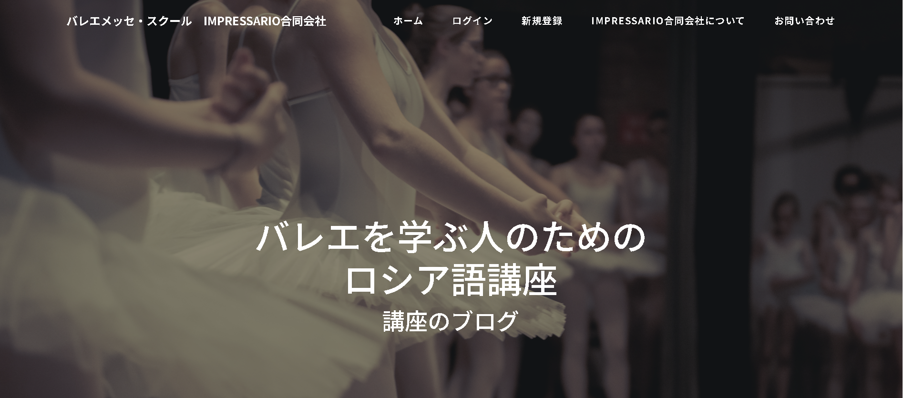
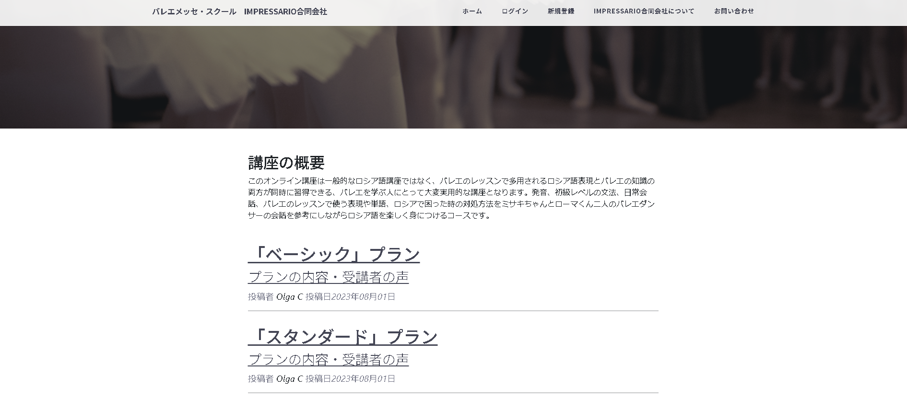
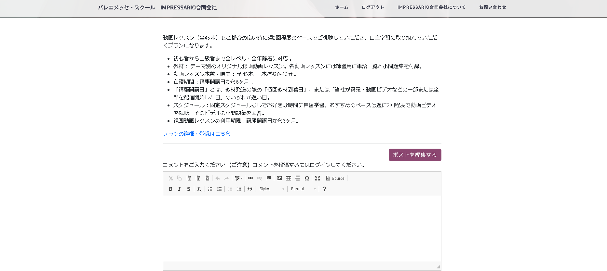
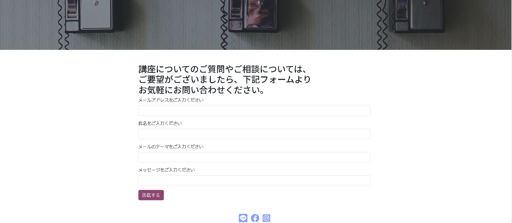

# Blog with users by Ballet Russian Language Course


This is a Python-based blog project built using the Flask web framework and Bootstrap.
The application uses a PostgreSQL database, which was created with the help of SQLAlchemy.
o safeguard sensitive information, password hashing and salting procedures utilizing sha256 have been implemented.

## Project Functionalities
The project includes an admin account, which has access to additional functionalities such as adding new posts, editing existing posts, deleting posts, and comments. These functionalities are disabled and hidden from regular users. The routes for these functions are forbidden for non-admin users to prevent unauthorized access.

Registered and logged-in users can leave comments on the blog posts. The 'Contact' tab allows viewers to send an email form via SMTP to the site owner's inbox using the Flask-Mail extension.

An algorythm to sanitize each client's HTML input is applied. The algorithm removes unwanted tags, attributes, unescaped characters, and unclosed or misnested tags.

## Deployment
The project is currently deployed on Render at https://blog-by-ballet-russian-language-course.onrender.com

## Preview





## Installation
1. Clone the repository: 
```
git clone https://github.com/visota2000/Blog_with_users_Flask.git
```
2. Change directory into the project folder
3. Create virtual environment: 
```
py -m venv venv
``` 
```
venv/Scripts/activate
```
4. Install the required packages: 
```
pip install -r requirements.txt
```
5. Create a PostgreSQL database.
6. Change environmental variables to your own database URL and email credentials.
7. Run the application
